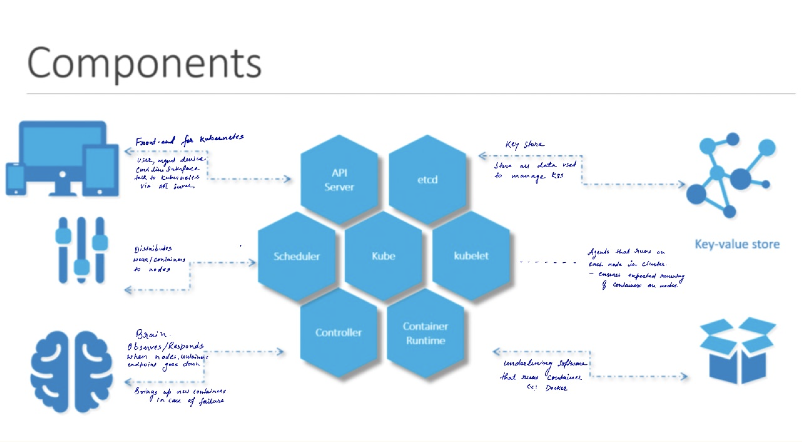
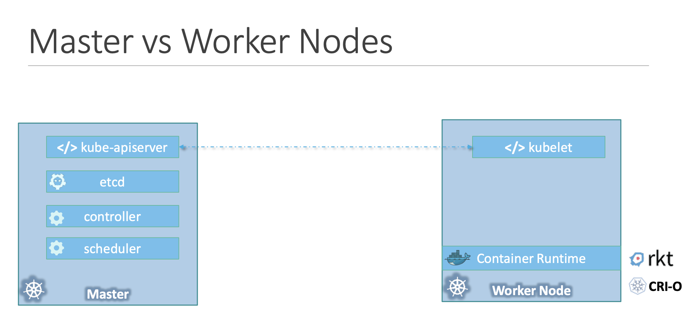
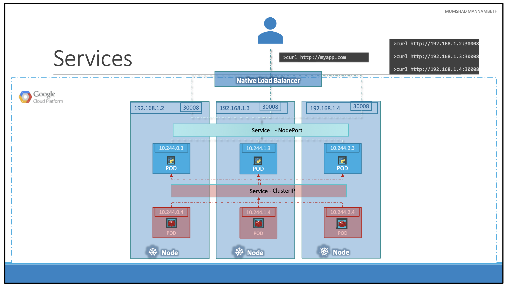
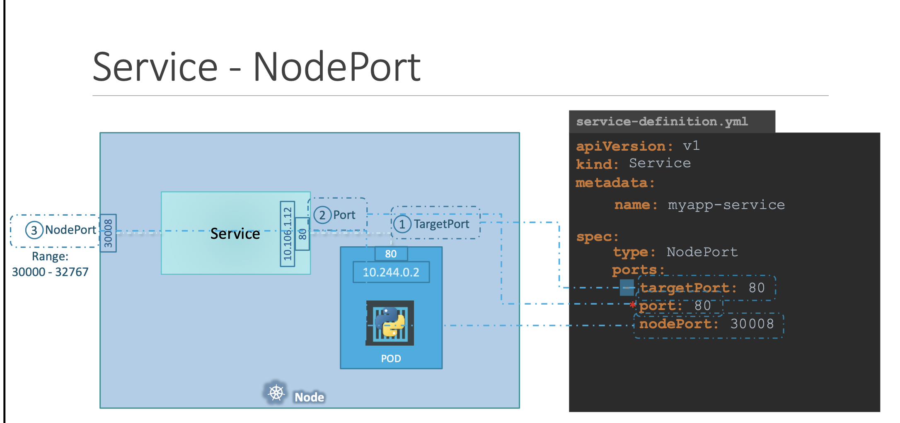

# Kubernetes

Kubernetes is a portable, extensible, open-source platform for managing containerized workloads and services, that facilitates both declarative configuration and automation.

## Component



## Master slave component ditribution



## Kubectl

The kubectl command line tool lets you control Kubernetes clusters. [cheatsheet](https://www.bluematador.com/learn/kubectl-cheatsheet)

```kubectl [command] [TYPE] [NAME] [flags]```

* **COMMAND:**  Specifies the operation that you want to perform on one or more resources, for example create, get, describe, delete.

* **TYPE:** Specifies the resource type. Resource types are case-insensitive and you can specify the singular, plural, or abbreviated forms. For example, the following commands produce the same output:

* **NAME:** Specifies the name of the resource. Names are case-sensitive. If the name is omitted, details for all resources are displayed, for example kubectl get pods.

## Pods

Pods are the smallest deployable units of computing that you can create and manage in Kubernetes.
In terms of Docker concepts, a Pod is similar to a group of Docker containers with shared namespaces and shared filesystem volumes.

Usually you don't need to create Pods directly, even singleton Pods. Instead, create them using workload resources such as Deployment or Job.

## Controllers

* **ReplicaSet** : A ReplicaSet's purpose is to maintain a stable set of replica Pods running at any given time. As such, it is often used to guarantee the availability of a specified number of identical Pods.
A ReplicaSet ensures that a specified number of pod replicas are running at any given time. However, a Deployment is a higher-level concept that manages ReplicaSets and provides declarative updates to Pods along with a lot of other useful features. Therefore, we recommend using Deployments instead of directly using ReplicaSets, unless you require custom update orchestration or don't require updates at all.
This actually means that you may never need to manipulate ReplicaSet objects: use a Deployment instead, and define your application in the spec section.
* **Deployments** : A Deployment provides declarative updates for Pods ReplicaSets.Deployment is at highe-level than replcaset. It provide us with the capabilities to upgrade theunderlying instances seamlessly usingrolling updates, undo changes and pause and resume changes to deployments [More info](https://kubernetes.io/docs/concepts/workloads/controllers/deployment/)

## Service

An abstract way to expose an application running on a set of Pods as a network service.
With Kubernetes we don't need to modify your application to use an unfamiliar service discovery mechanism.
Services enable comunication between various component within and outside of teh application

* NodePort   -- for extrnal communication
* ClusterIP  -- for internal seen in Yara/Facl
* LoadBalancer -- for cloud


NodePort: Exposes the service on each Node’s IP at a static port (the NodePort). A ClusterIP service, to which the NodePort service will route, is automatically created. You’ll be able to contact the NodePort service, from outside the cluster, by requesting <NodeIP>:<NodePort>. 




ClusterIP: Exposes the service on a cluster-internal IP. Choosing this value makes the service only reachable from within the cluster. This is the default ServiceType

LoadBalancer: Exposes the service externally using a cloud provider’s load balancer. NodePort and ClusterIP services, to which the external load balancer will route, are automatically created.


## Some used command

```
kubectl describe pod newpod
kubectl run redis --image=redis123 --dry-run=client -o yaml >pod.yaml

kubectl create -f .\replicaset.yaml
kubectl get replicaset 
kubectl delete pod myapp-replicaset-c254j
kubectl describe replicaset myapp-replicaset
edit replicaset myapp-replicaset
kubectl scale replicaset myapp-replicaset --replicas=2

 kubectl explain replicaset|grep VERSION
 kubectl delete replicaset
 kubectl edit replicaset new-replica-set
 kubectl get all
 kubectl get deployment

 kubectl describe deployments.apps name | grep -i image

 kubectl run nginx --image=nginx    ----- creates deployment

 kubectl create -f deployment.yaml
 kubectl rollout status deployment.apps/myapp-deployment
 kubectl rollout history deployment.apps/myapp-deployment

 kubectl edit deployment myapp-deployment --record
 kubectl rollout undo deployment/myapp-deployment 
 kubectl get svc

```
