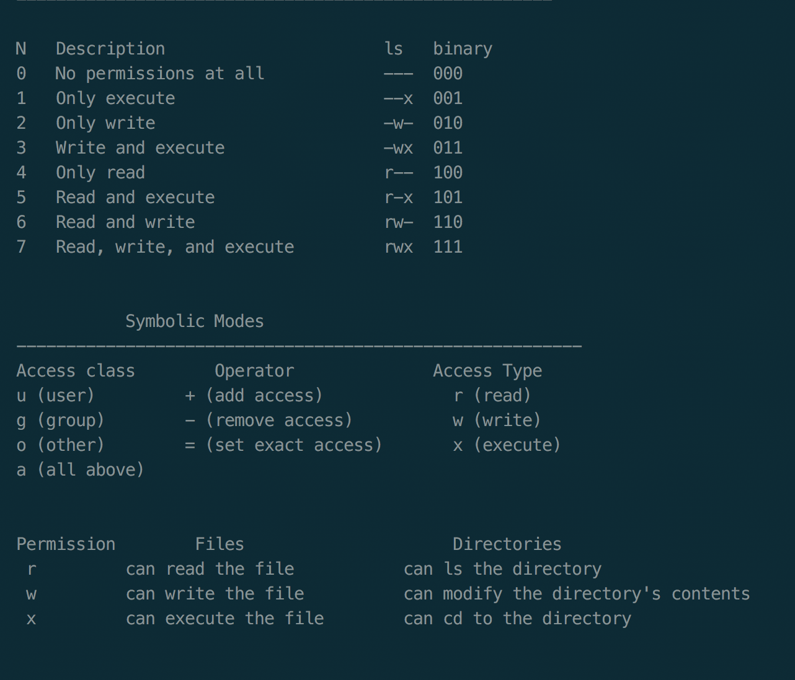

# Unix

### Permissions & Ownlership
##### chmod
chmod is the command and system call which is used to change the access permissions of files and directories


Numeric Example:
```bash
ls -l  # show access modes before chmod
-rw-r--r--  1 amitash.anand  developer  0 May 16 16:48 file.txt
chmod 666 file.txt
ls -l  # show access modes after chmod
-rw-rw-rw-  1 amitash.anand  developer  0 May 16 16:48 file.txt
```
Symbolic Example:
```bash
ls -l  # show access modes before chmod
-rw-r--r--  1 amitash.anand  developer  0 May 16 16:48 file.txt
chmod a+w file.txt
ls -l  # show access modes after chmod
-rw-rw-rw-  1 amitash.anand  developer  0 May 16 17:39 file.txt
file.txt
```
##### chown

